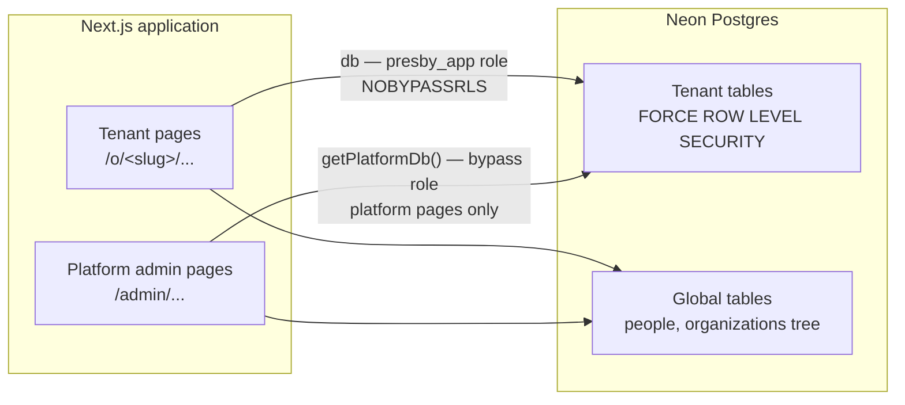

# PresbyPortal — Architecture Overview

*A first read for engineers joining the project. This document explains what we're building and why, what actually works today, and the handful of decisions that shape everything else. It intentionally stays high-level — each section links to the document that has the actual detail, rules, and rationale.*

*Last written: 2026-08-27. The project is named **PresbyPortal** (`presbyportal.org`, DECISION-126) — that naming period is over. The code itself, deliberately, hasn't caught up yet: the database role, every SQL function, and every migration filename still use the `presby` prefix, and that's staying put on purpose until a dedicated rename pipeline runs (a live Postgres role and every RLS policy in this codebase reference it by name — see `docs/STATE.md`). This document uses PresbyPortal in prose and `presby` where it names an actual identifier in the code.*

---

## 1. What this is, and why it exists

**PresbyPortal is a multitenant platform for Presbyterian congregations, presbyteries, and synods** — the three levels of a PC(USA) governing structure. One church management system serves membership rolls, officer records, a member directory, groups, and events; one set of tools serves council operations (the presbytery/synod layer above a congregation, including the first mechanism by which a congregation's own records become a presbytery's own record — see idea 4 below); every tenant gets a public website; and a support-ticket loop, worked partly by an AI pairing with a human operator, is how the platform grows and gets fixed.

The reason to build this rather than buy something existing: PC(USA) polity has real structure that generic church-management software gets wrong — who's a member of what, who can approve what, which records are permanent — and getting it wrong either produces bad data or requires a human to work around the software forever. We had the chance to design the schema *from* the polity instead of bolting polity onto a generic contacts database, and did.

Four sibling projects (independent prior builds, not part of this codebase) fed real requirements in before a line of schema was written: a 69-table church portal, a 24-table fund-accounting system, a presbytery-operations tool, and a public-facing "learn" site with an AI assistant. Where this document says "we decided X," it usually means three of those four hit the same wall and we designed around it.

---

## 2. What actually works today, by who's using it

This is deliberately a *functional* summary, not an implementation one — for the full, current, line-by-line inventory of what's built vs. designed-but-not-built, see [`docs/product/functionality-map.md`](product/functionality-map.md), which this section is a plain-language digest of.

**A congregation's own staff and clergy**, once their tenant is provisioned, can: search and browse the membership directory (with per-field privacy — a member can hide their own phone number, address, or photo from other members); record roll actions (a profession of faith, a transfer, a death) against the permanent membership ledger; record and end session/diaconate officer terms; create and manage committees and groups (the session and diaconate rosters themselves are *derived*, not editable — see idea 3); enter tiered pastoral, medical, demographic, and disability information behind separate, narrower permissions than ordinary member data; track children in the congregation and who their guardians are; schedule one-time or recurring events; file and track support tickets; set their own congregation's brand (colour, logo, type pairing); and, once the feature is turned on for them, publish a public website built from content they control in their own separate repository (built and tested; not yet turned on for any real congregation).

**A presbytery's stated clerk** gets everything a congregation gets, plus tools scoped to the presbytery level: recording ministers' ordinations and standing, recording and ending pastoral appointments to member congregations, and — the newest piece — recording the presbytery's own judgment about a member congregation's viability and property (a health assessment that belongs to the presbytery, never the congregation, so it needs none of the cross-org machinery below) and entering or receiving that congregation's annual statistics for per-capita billing. Every statistics figure is labeled by where it came from — entered by the presbytery, or published by the congregation itself — so nothing pretends to be more authoritative than it is.

**A platform operator** manages the roster of tenants, feature flags, per-congregation two-factor policy, the audit log, and the ticket/feedback queues, through an admin portal that shows each operator only the tools they're actually entitled to use — never the full list with most of it denied on click.

**Anyone signed in** lands on one page after authenticating that shows their own organizations and, if they hold platform-level access, the platform tools they hold — not a chooser screen followed by a second, separately-designed page.

**Not yet built**, named honestly rather than glossed over: fund accounting/giving, worship and service planning, event check-in, a public event calendar, presbytery committee and commission tracking, and a presbytery-wide rollup dashboard (a viability map across every member congregation). Each has a real, working "coming soon" placeholder in the product today rather than a dead link.

---

## 3. The domain model, in five ideas

Everything else in the schema is downstream of these five decisions. Full rationale and the review-findings log that tested them are in [`docs/schema-design.md`](schema-design.md).

1. **A person is global; membership is per-organization.** `people` holds the human. `memberships` links a person to an organization and carries their roll status *there*. This isn't a convenience split — it's required by polity: a minister is a member of their *presbytery*, not the congregation they serve, while a ruling elder is a member of the *congregation*. One person routinely has different standing at different organizations simultaneously.
2. **The roll is a ledger, not a status field.** `roll_actions` is append-only — what the session actually did, in order. The member directory, the annual statistical report, and per-capita billing are all *views* of that ledger, not separately-maintained data. An approved action is frozen; a mistake is corrected by recording a `void`, never by editing history.
3. **A court (Session, Diaconate) is not a group someone edits.** Its roster is *materialized from* officer terms by a database trigger and rejects direct writes. If staff could add a name to the Session roll by hand, every vote that roster took would be legally questionable.
4. **Authority flows up by publication, never down by inheritance.** A presbytery sees what a congregation is required to publish to it and nothing else by default. This is no longer just a stated principle — it's a real mechanism now: a congregation's own clerk publishes an annual statistical snapshot, and the write that creates the presbytery's copy of it is a single, narrow database function that derives its own target (the calling congregation's actual parent presbytery) rather than trusting anything the caller supplies — the platform's first write that ever crosses a tenant boundary, and it was built to be the only kind that's allowed to. The only other exceptions — an administrative commission, and a session-granted delegation — are both explicit, time-boxed, and minuted, not ambient access.
5. **Isolation is a property of the database, not a habit of the application code.** Detailed in the next section, because it's the thing any engineer joining this project should understand before touching a query.

---

## 4. Tenant isolation — the part to understand before writing a query

Every tenant table has Postgres row-level security **forced**, not just enabled. That distinction matters more than it sounds: `FORCE ROW LEVEL SECURITY` is required because Postgres otherwise exempts the table's own owner from RLS — with a shared application role, "enabled but not forced" RLS is silently inert, and every naive test still passes. This was found by running the isolation suite, not by reading the schema; it's now the first thing `scripts/test-rls.sql` checks for.

Two separate database connections exist on purpose:

- **`db`**, using a role that is `NOBYPASSRLS` — every tenant query filters to the caller's own organization, enforced by Postgres itself. This is what every `/o/<slug>/...` page uses.
- **`getPlatformDb()`**, which bypasses RLS entirely. It exists only for platform-admin pages that legitimately need to see across every tenant (user management, cross-org ticket triage). `users.is_platform_admin` decides which *pages* are reachable — it never decides whether a query is filtered. Conflating those two questions is exactly the bug class this split exists to prevent.

A tenant request never reaches the database without first calling `withOrgContext()`, which **verifies real membership, then sets a transaction-scoped session variable** that every RLS policy checks. The order matters: this function was once written to set the variable first and verify second, and it rejected every legitimate member for weeks before anything exercised it — the check that was supposed to prevent cross-tenant access instead prevented *all* access, silently, because nothing had called it yet. It's now covered by an integration test that would fail loudly if that ordering ever regresses.

The other structural rule worth knowing: **every foreign key between two tenant tables is composite** — `(id, organization_id)`, not just `id`. A plain `people(id)` reference would let a row in one organization point at a person in a different one; Postgres filters what you can *read* through RLS, but a composite key is what stops you from *writing* that mistake in the first place.

---

## 5. Authorization — separate from isolation, and deliberately narrow

Isolation answers "can this query see this organization's data at all." Authorization answers "may *this person* do *this specific thing* at this organization" — a different question, resolved by a single function, `presby_effective_permissions()`, with four independent ways a person can hold a permission:

1. **Directly** — a role granted to one named person.
2. **Through a group** — a role granted to a derived group (e.g. the Session), which a person is a member of.
3. **Through an administrative commission** — a presbytery body temporarily exercising a congregation's own authority.
4. **Through a delegation** — a session explicitly, temporarily handing a power to someone else.

Two rules discipline this system on purpose:

- **No role ever carries a wildcard.** A "Church Administrator" role does not get read access to pastoral notes by default — every permission is granted explicitly, at the tier it belongs to (1: directory, 2: financial, 3: pastoral/medical — pastoral sits *above* financial, on purpose). The one known exception is the inherited platform-shell `ADMIN_ROLE`, which predates this discipline; it's bounded (it can't reach tenant data) but flagged as a standing exception, not held up as the pattern to follow.
- **Permissions and flags are never the same mechanism.** A permission answers "may this user do this." A feature flag answers "is this capability turned on at all, for anyone." A gated feature checks both, separately — a flag never grants access, and a permission never stages a rollout.

The worked example worth reading if you want to see this reasoning applied end to end is `docs/decisions.md`'s DECISION-066 through DECISION-080: the question of "who gets to grant software access to others, before anyone's been granted anything yet" — resolved by mapping it onto a real PC(USA) office (the Stated Clerk) rather than inventing a generic admin concept, and then, later, deliberately *un-piggybacking* a second capability off that same office once the resulting concentration of power was noticed — with the reasoning for both calls recorded, not just the outcome.

---

## 6. Extensibility: tags, and everything else is a conversation

Most church-management software lets an administrator add arbitrary custom fields. We looked at that closely and rejected it: a custom field nobody designed has no validation, no place in a report, and no defined sensitivity tier — and it's a decision made in isolation by one congregation's admin that then has to be supported forever.

**Tags are the only tenant-extensible attribute in the schema.** Everything else a congregation might need becomes a support ticket, and — this is the important part — **if the need is real, it becomes a feature every congregation gets**, not a one-off field for whoever asked. This is what makes the ticket loop load-bearing infrastructure rather than a help desk bolted on afterward: it's the *only* path by which the platform grows past what's already built.

---

## 7. The support-ticket loop

A congregation designates someone (a real office-holder, not "any staff member with a login") who can file a ticket on the congregation's behalf. Ordinary members have a lighter-weight path too — anyone can leave feedback about their congregation's experience, and the designated role-holder can promote a piece of feedback into a formal ticket if it's worth acting on. Every ticket carries a category, an area, and a priority from a fixed, small vocabulary — not because the categories gate anything automated today, but because a well-structured ticket is one an AI-assisted first pass can actually act on, rather than one that needs a round of back-and-forth just to understand what's being asked.

Tickets are worked on the platform side by a human operator, most often paired with an AI coding assistant doing the actual investigation and change — the same working relationship this document itself was written under. That's a deliberate choice: the platform does **not** run an autonomous AI agent with standing write access to tenant data. Every change a ticket produces is an ordinary, reviewed engineering change with a human accountable for it — the ticket is the paper trail, not a trigger for unsupervised automation.

---

## 8. Public websites — how a congregation's site gets built and stays current

*This piece is newer than the rest of this document — built and tested to the shape described below, but not yet turned on: it ships behind the `sites.public_render` flag, seeded off, and no real congregation has a provisioned site yet. The mechanism is proven; the rollout hasn't started. Full pipeline history, and the open operational question of content-repo visibility that has to be settled before the first real site is provisioned, are in [`docs/work-log/2026-08-20-public-sites.md`](work-log/2026-08-20-public-sites.md).*

The constraint that shaped this design: **PresbyPortal's own source repository must never contain a real congregation's data** — not a real name, address, photo, or phone number, ever, because that's a permanent, effectively unscrubbable commitment once it's in git history. A congregation's public website necessarily *is* real content. So it can't live in this repository, and it can't be built the way most of this platform is built.

The shape we landed on, after working through a few alternatives:

- **A congregation's site content lives in its own, separate Git repository** — one per congregation, containing only page content (Markdown-with-components) and images. No application code lives there.
- **A small shared repository holds the actual rendering code** — a fixed, deliberately limited set of page components (a hero section, a staff list, a contact form, and similarly a handful of others) that every congregation's content can use, plus the automated checks that validate a change before it's allowed to go live.
- **The main platform is the only thing that ever runs.** There's no separate deployment per congregation. When a congregation's content changes, an automated check validates it, converts it into a structured (not yet rendered) form, and hands it to the platform — which is the only place that ever turns content into an actual page.

The reason for that last point is the one worth remembering: it would have been possible to let each congregation's repository build and deploy its own independent copy of the site — closer to a classic "micro-frontend" approach. We didn't, because that means a congregation's repository ships *code* that would run inside the platform, and content is not a security boundary you want to depend on hundreds of independent, loosely-supervised repositories to respect. Under the design we chose, a congregation's content can never become more than content — the platform's renderer simply doesn't know how to execute anything it wasn't built to render. That's a guarantee about what *can* happen, not a policy about what *should*.

---

## 9. Personalization

Each congregation can set its own brand — a colour, a logo, a type pairing — from a closed set of options the platform validates for accessibility before it's ever shown to anyone (every combination is checked against a contrast floor at generation time, not left to chance). That brand identity is intentionally the *only* per-tenant styling mechanism in the whole platform: there's no second, parallel way to customize appearance, which is what keeps hundreds of tenants' worth of visual variation from turning into hundreds of one-off maintenance burdens. The public website work above reuses this system rather than inventing a second one.

---

## 10. Stack, in one paragraph

Next.js 16 (App Router) and React 19, TypeScript throughout in strict mode. Drizzle ORM against Neon Postgres, deliberately over a WebSocket connection pool rather than Neon's simpler HTTP driver — the isolation model in section 4 depends on a transaction-scoped session variable, and the HTTP driver has no notion of a transaction, so the isolation model dictated the driver, not the other way around. NextAuth for authentication, Tailwind and Radix for UI primitives, deployed to Vercel.

---

## 11. How work actually happens in this codebase

Every non-trivial change goes through the same six checkpoints — a functional review before any design starts, an architectural review before any code is written, a technical design with a named implementer, the implementation itself, independent verification, and a final check that what shipped actually matches what was asked for. Nothing is called finished until that last check passes. The point isn't process for its own sake — it's that this is a schema with real invariants (the isolation model above being the sharpest example), and every one of the defects mentioned in this document that actually shipped was caught by *running* something, not by reading the code. The checklist exists because reading carefully wasn't enough on its own, repeatedly, before it existed.

The full mechanics — which review happens when, what "done" requires — are in the project's own contributor guide (`CLAUDE.md`), not repeated here.

---

## 12. Where things stand, and where to go deeper

This document won't age well as a status report, so it doesn't try to be one. For current state:

| Question | Where to look |
|---|---|
| What's actually built vs. designed-but-not-built | [`docs/product/functionality-map.md`](product/functionality-map.md) |
| Full schema rationale, every table, the review-findings log | [`docs/schema-design.md`](schema-design.md) |
| Every architectural decision, numbered, with the reasoning behind it | [`docs/decisions.md`](decisions.md) |
| Current project snapshot, fixture accounts, how to run it locally | [`docs/STATE.md`](STATE.md), [`docs/testing.md`](testing.md) |
| How a specific feature was built, phase by phase | `docs/work-log/` — one file per feature, newest first |
| Day-to-day conventions for working in this repo | `CLAUDE.md` |

If you're reading this before your first real session in the codebase: start with `docs/STATE.md`, then come back to whichever section above matches what you're about to touch.
