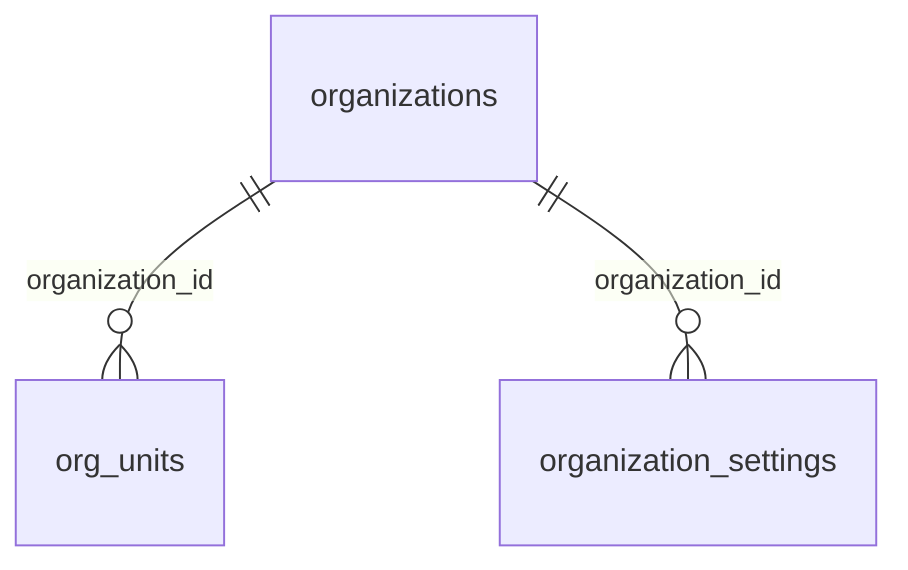
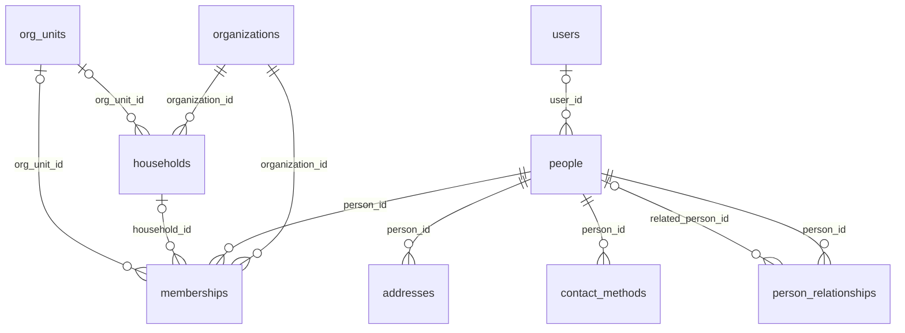
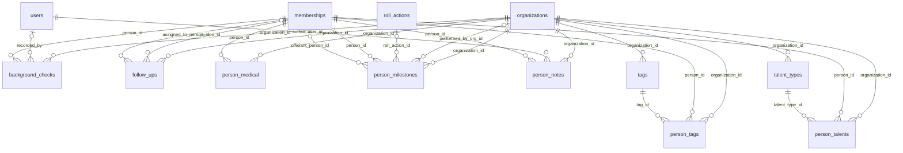
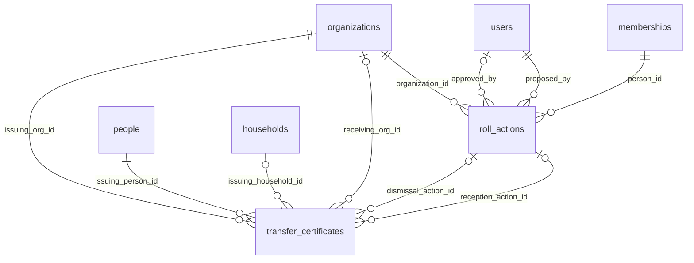
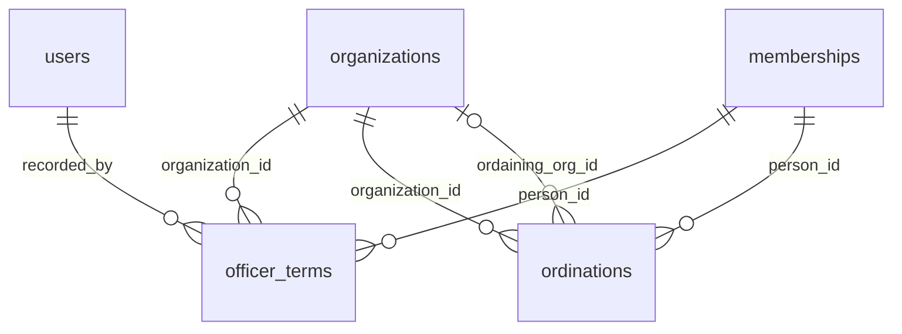
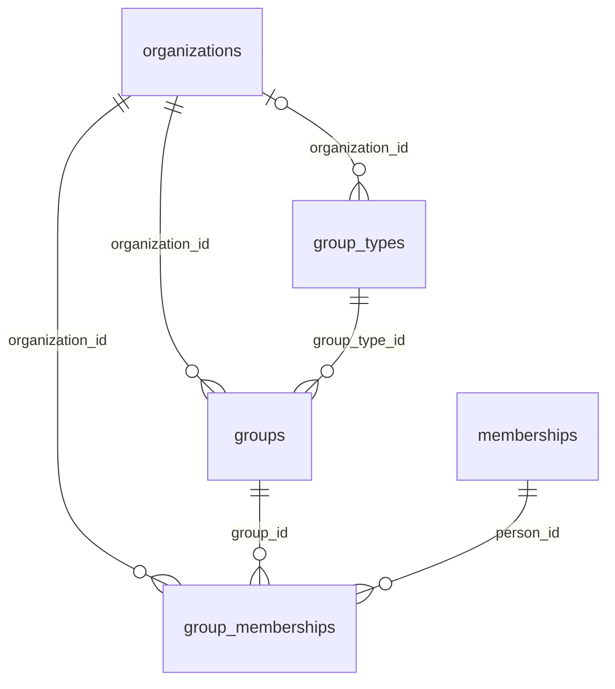
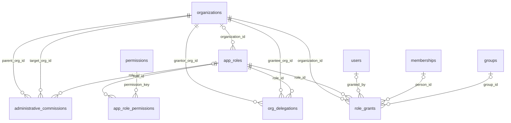
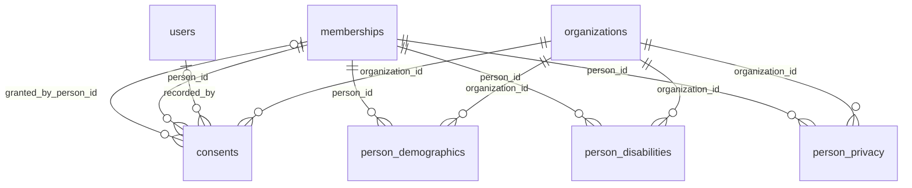
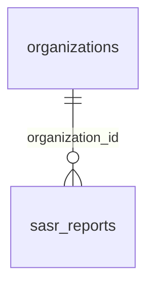

# presby — First-Pass Schema Design

**Status:** Draft for review round 1 (revision 2)
**Scope:** Phase 0 (spine) and Phase 1 (person, roll, officers, groups, portal home, profile).
Ledger, giving, events, worship, and check-in are excluded pending their own requirements pass.
Sites and tickets are sketched because their shape constrains Phase 0 decisions.

**Revision 2:** roll approval is a status on the action row, not a meetings module; the person model
is driven by congregational practice rather than by the SASR, and covers everything fpcw's `members`
table carries plus the common field set across Planning Center, Breeze, Rock, and ChurchCRM.

**Revision 3:** **D1 reversed — `people` is global** (§6). Custom fields removed; tags are the only
tenant-extensible attribute (D8). `person_links` deleted. Implemented in `src/lib/db/domain/`, with
generated ER diagrams in §4 and a live reference at `/developer`.

---

## 1. Invariants

1. **Two hierarchies intersect nowhere.** Ecclesiastical (congregation, presbytery, synod, GA) and
   platform (tenant user, tenant admin, platform admin) are different axes. A platform admin is not
   above a national admin.
2. **Access flows up by publication, never down by inheritance.** A presbytery admin has no read
   access inside a member congregation. The only downward paths are an administrative commission and
   an explicit congregation-granted delegation, both time-boxed and audited.
3. **Tenant isolation is a database property.** The application's normal database role can never
   bypass RLS.
4. **An approved roll action is immutable.** Corrections are recorded as voiding actions, never as
   updates or deletes.
5. **Session and diaconate membership is derived, never edited.** Rosters project from officer terms.
6. **No role carries a wildcard.** Not even administrator roles.
7. **Nothing about a person is ever hard-deleted.** PC(USA) records are permanent.
8. **The SASR is a projection, never a data-entry screen.** If a report field cannot be derived, the
   gap is in the operational model, not in the report.

---

## 2. Decisions this draft assumes

| # | Decision | Choice | If we change it |
|---|---|---|---|
| D1 | Person scope | **Global `people` + org-scoped `memberships`** | *Reversed after review.* Decided on polity, not convenience: ministers of Word and Sacrament are members of the **presbytery** (G-2.0502, G-2.0503) while ruling elders are members of the **congregation**, so one human's roll and service routinely sit at different orgs. Org-scoped people forced two rows per pastor and minted a duplicate on every transfer. Cost: `people` is a cross-tenant surface and its policy is an EXISTS, not a column compare — which exposed F21. |
| D2 | Event primitive | **Shared column contract across tables**, not one polymorphic table | Polymorphic loses foreign keys and typed columns. |
| D3 | Roll approval | **Status on `roll_actions`** (`pending → approved`), free-text minute reference. Meetings/agenda automation deferred (§16). | Full meetings module gives a real FK and serves minutes review, but is not worth putting on the Phase 1 critical path. |
| D4 | Demographics | **Per-person, tier 3**; disability behind per-church opt-in | Aggregate-only removes consent machinery but the SASR can no longer self-generate. |
| D5 | Other participants roll | **Staff enrolls, session ratifies annually** | Session-act enrollment is cleaner but the roll goes stale. |
| D6 | Polity | **PC(USA) only**; vocabulary in seed data where cheap | Pluggable polity pushes roll actions and org types into configuration. |
| D7 | Platform admin | **Boolean on `users` + separate DB connection**; no elevation machinery yet | Break-glass elevation lands in Phase 5 with the AI worker. |
| D8 | Extensibility | **No custom fields. Tags only; everything else is a support ticket.** | *Reversed after review.* Custom fields are what every surveyed ChMS does, but a per-church field nobody designed has no validation, no reporting, and no enforced sensitivity tier, and it fragments the schema the reusable-component thesis depends on. Consequence: the ticket loop becomes the sole extensibility path, so it cannot be the last thing built. |

---

## 3. Conventions

- `uuid` primary keys via `gen_random_uuid()`. `timestamptz` throughout.
- `recorded_at` is when we learned it; `effective_date` (a `date`) is when it took effect.
- Every tenant-owned table carries `organization_id uuid not null`.
- **Every index on a tenant-owned table leads with `organization_id`.** Lint rule, not convention.
- RLS on every tenant-owned table:
  ```sql
  alter table <table> enable row level security;
  alter table <table> force  row level security;   -- REQUIRED: see F1
  create policy tenant_isolation on <table>
    using (organization_id = current_setting('app.current_org_id', true)::uuid);
  ```
  Set with `set_config('app.current_org_id', $1, true)` — transaction-local, required for
  correctness behind a transaction-mode pooler.

  **`force` is not optional.** Without it, the table owner bypasses every policy. If migrations and
  the application share a role, RLS is silently inert and every isolation test still passes.

  **RLS enforces tenancy, not authorization.** The policy trusts whatever org id the app puts in the
  GUC. The application must verify the user actually belongs to that org *before* calling
  `set_config`. RLS stops a query from crossing tenants; it does not decide which tenant you are.

- **Composite tenant keys.** Every tenant-owned table declares `unique (id, organization_id)`, and
  every foreign key between tenant-owned tables is composite:
  ```sql
  foreign key (person_id, organization_id) references people (id, organization_id)
  ```
  A plain `references people(id)` lets a row in org B point at a person in org A. RLS will not catch
  it, because RLS filters reads and this is a bad write. See F2.
- Append-only tables have `update`/`delete` revoked from the application role. `people` has `delete`
  revoked outright (invariant 7).
- Sensitivity tiers: **1** directory, **2** financial, **3** pastoral/demographic/medical.

---

## 4. Entity relationships

<!-- BEGIN GENERATED ERD -->

_Generated by `npm run docs:erd` from `src/lib/db/schema`. Do not hand-edit._

### A. Organizations



### B. People



### C. Person extensions



### D. Rolls



### E. Officers



### F. Groups



### G. Authorization



### H. Privacy



### J. Reporting



<!-- END GENERATED ERD -->

---

## 5. Section A — Organizations

```sql
create type organization_type as enum (
  'general_assembly', 'synod', 'presbytery', 'congregation', 'new_worshiping_community'
);

create table organizations (
  id                uuid primary key default gen_random_uuid(),
  parent_id         uuid references organizations(id),
  organization_type organization_type not null,
  name              text not null,
  slug              text not null unique,
  pcusa_pin         text,
  path              ltree not null,          -- materialized ancestry, trigger-maintained
  status            text not null default 'active',
  settings          jsonb not null default '{}',
  created_at        timestamptz not null default now()
);
create index on organizations using gist (path);

-- Optional subdivision inside a congregation. fpcw calls these parishes;
-- elsewhere: deacon districts, care groups, campuses (multi-site).
create table org_units (
  id               uuid primary key default gen_random_uuid(),
  organization_id  uuid not null references organizations(id),
  unit_type        text not null,            -- parish | campus | district
  name             text not null,
  shepherd_person_id uuid references people(id)   -- assigned deacon or elder
);
```

`path` makes "every congregation under this presbytery" an index scan rather than a recursive CTE.

---

## 5. Section B — People and households

Superset of fpcw's `members` plus the common field set across the surveyed ChMS tools.

**The D1 split, and where the line falls.** The question for every table is whether the row is about
the *person* or about the *relationship*.

| About the person | About the relationship |
|---|---|
| `people`, `addresses`, `contact_methods`, `person_relationships` | `memberships`, and every org record *about* a person: `roll_actions`, `officer_terms`, `person_notes`, `tags`, `talents`, `background_checks`, `person_privacy`, `person_demographics` |
| Link straight to `person_id`. No `organization_id` at all. | Keep the composite `(person_id, organization_id)` key. |

An address is the same address whichever congregation is looking. Duplicating it per org means an
installed pastor's phone number is entered twice and diverges. The composite key is not ceremony on
the right-hand column, though: it is what stops Church B writing notes about someone they have no
relationship with (F2).

```sql
create table people (                 -- GLOBAL. No organization_id.
  id, user_id, title, first_name, preferred_name, middle_name, last_name,
  suffix, former_name, date_of_birth, birth_year_only, date_of_death,
  marital_status, anniversary_date, occupation, employer, school, grade,
  primary_language, photo_key, merged_into_id
);

create table memberships (            -- THE LINK, org-scoped
  id, organization_id, person_id,
  org_unit_id, household_id, household_role,
  engagement_status, first_visit_date, how_heard,
  current_roll, current_roll_since,
  ended_on, ended_reason,
  external_ids, mailchimp_status,
  unique (person_id, organization_id)   -- the composite-FK target
);
```

A transfer does not move or copy a person: it ends the membership at the losing church and opens one
at the receiving church against the same `people` row. A pastor holds two at once — membership at
the presbytery, service at the congregation. Named to parallel `group_memberships`: that is the
person-to-group link, this is the person-to-organization link.

**Visibility.** A global person row is readable when the current org holds a membership for that
person:

```sql
create policy visible_via_membership on people
  using (exists (select 1 from memberships m
                  where m.person_id = people.id
                    and m.organization_id = presby_current_org()));
```

**F21 — the policy above is self-granting, and that is the hole.** Nothing stopped a church from
inserting a membership for an arbitrary `person_id` and immediately reading that person's name,
birthdate, address, and phone. The composite foreign keys never protected against this; the guard
has to live on the act of *linking*. A membership insert is now allowed only when the person has no
membership anywhere (this org is creating them, so there is nothing to disclose) or when
`presby_claim_person()` authorized it against a claimable transfer certificate.

Duplicate detection still needs to read rows the caller cannot see. `presby_match_person()` is
`security definer` and returns a person id, an initial-plus-surname display string, and a confidence
band — never a row.

**`person_links` is deleted.** Its only job was joining org-scoped duplicates of one human. With
global `people` there are none, so the table, its bespoke cross-tenant policy, and the disclosure it
leaked all disappear.

```sql
create table households (
  id               uuid primary key default gen_random_uuid(),
  organization_id  uuid not null references organizations(id),
  name             text not null,                    -- "The Smith Family"
  formal_name      text,                             -- "Mr. and Mrs. John Smith"
  informal_name    text,                             -- "John and Mary"
  is_giving_unit   boolean not null default true,    -- SASR "potential giving units"
  org_unit_id      uuid references org_units(id),
  created_at       timestamptz not null default now()
);

create table addresses (
  id               uuid primary key default gen_random_uuid(),
  organization_id  uuid not null references organizations(id),
  household_id     uuid references households(id),
  person_id        uuid references people(id),       -- person-level overrides household
  address_type     text not null,                    -- home | seasonal | mailing | work
  line1 text, line2 text, city text, region text, postal_code text, country text default 'US',
  latitude numeric, longitude numeric,               -- fpcw maps deacon care areas
  season_start     date,                             -- snowbirds; null = year-round
  season_end       date,
  is_primary       boolean not null default false,
  check (household_id is not null or person_id is not null)
);

create table contact_methods (
  id               uuid primary key default gen_random_uuid(),
  organization_id  uuid not null references organizations(id),
  person_id        uuid not null references people(id),
  kind             text not null,                    -- email | phone
  subtype          text,                             -- mobile | home | work
  value            text not null,
  is_primary       boolean not null default false,
  do_not_contact   boolean not null default false,
  verified_at      timestamptz
);
create index on contact_methods (organization_id, person_id);
create index on contact_methods (organization_id, lower(value));
```

**Seasonal addresses are not an edge case.** The SASR names snowbirds as a common affiliate member
scenario, and fpcw geocodes addresses for deacon care areas, hence lat/long here.

### Relationships beyond the household

```sql
create table person_relationships (
  id               uuid primary key default gen_random_uuid(),
  organization_id  uuid not null references organizations(id),
  person_id        uuid not null references people(id),
  related_person_id uuid references people(id),
  related_name     text,                             -- when the other party is not in the system
  relationship     text not null,                    -- spouse | parent | child | guardian | grandparent |
                                                     -- sibling | emergency_contact | caregiver | pastor
  is_emergency_contact boolean not null default false,
  notes            text,
  check (related_person_id is not null or related_name is not null)
);
```

Planning Center stores these in custom fields, which is a known weakness. Guardian and emergency
contact are load-bearing for children's check-in, so they are first-class here.

### Cross-org identity (D1)

```sql
create table person_links (
  id             uuid primary key default gen_random_uuid(),
  person_a_id    uuid not null references people(id),
  person_b_id    uuid not null references people(id),
  link_reason    text not null,          -- transfer | cross_org_service | merge_candidate
  established_by uuid references users(id),
  established_at timestamptz not null default now(),
  check (person_a_id < person_b_id),
  unique (person_a_id, person_b_id)
);
```

Deliberately not tenant-scoped: it is the one seam between orgs. Reading it requires a permission at
*both* orgs, or the platform connection. A certificate of transfer between two congregations on the
platform creates a link plus a matched pair of roll actions.

---

## 6. Section C — Person extensions

Everything a congregation keeps that is neither a roll fact nor a contact detail. Drawn from fpcw
plus the common denominator across Planning Center, Breeze, Rock RMS, and ChurchCRM.

### Tags

```sql
create table tags (
  id               uuid primary key default gen_random_uuid(),
  organization_id  uuid not null references organizations(id),
  name             text not null,
  category         text,
  color            text,
  unique (organization_id, name)
);

create table person_tags (
  organization_id  uuid not null references organizations(id),
  person_id        uuid not null references people(id),
  tag_id           uuid not null references tags(id),
  applied_at       timestamptz not null default now(),
  primary key (person_id, tag_id)
);
```

**Tags are the only tenant-extensible attribute in the schema** (D8). They cover ad-hoc grouping and
event targeting, which is most of what custom fields get used for in the surveyed tools. Anything
needing validation, reporting, or a sensitivity tier is a support ticket, and if the need is real it
becomes a first-class feature for every church rather than a column in one. fpcw's `tags text[]`
becomes this.

The honest cost: without a pressure-relief valve, low-stakes requests ("track who has a building
key") land in the ticket queue too. That is survivable only if the loop is fast, which is why D8
pulls ticketing forward out of Phase 5.

### Milestones and sacraments

```sql
create table person_milestones (
  id               uuid primary key default gen_random_uuid(),
  organization_id  uuid not null references organizations(id),
  person_id        uuid not null references people(id),
  milestone        text not null,          -- baptism | confirmation | marriage | ordination |
                                           -- funeral | first_communion | profession_of_faith
  occurred_on      date,
  location         text,
  officiant_person_id uuid references people(id),
  officiant_name   text,                   -- when not in the system
  witnesses        text,                   -- sponsors, godparents, attendants
  performed_by_org_id uuid references organizations(id),
  roll_action_id   uuid references roll_actions(id),   -- when it also changed the roll
  notes            text
);
create index on person_milestones (organization_id, milestone, occurred_on);
```

This is the **register of baptisms** required by G-3.0204(b), and it absorbs fpcw's `date_baptized`,
`date_confirmed`, and `anniversary_date`. A baptism that also enrolls someone as a baptized member
links to its roll action; a baptism of an existing member does not.

### Notes and pastoral care (tier 3)

```sql
create table person_notes (
  id               uuid primary key default gen_random_uuid(),
  organization_id  uuid not null references organizations(id),
  person_id        uuid not null references people(id),
  note_type        text not null default 'general',   -- general | pastoral_care | visit | prayer | admin
  visibility       text not null default 'staff',     -- staff | pastoral | clergy_only
  body             text not null,
  occurred_on      date,
  author_user_id   uuid not null references users(id),
  created_at       timestamptz not null default now()
);
create index on person_notes (organization_id, person_id, created_at desc);
```

`visibility = 'clergy_only'` is the strictest grant in the system. Pastoral care notes carry clergy
confidentiality, sit above financial data in sensitivity, and the AI worker never receives a grant
on this table under any elevation.

### Follow-ups and assimilation

```sql
create table follow_ups (
  id               uuid primary key default gen_random_uuid(),
  organization_id  uuid not null references organizations(id),
  person_id        uuid not null references people(id),
  workflow         text,                   -- first_visit | new_member | inactive_outreach | care
  step             text,
  assigned_to_person_id uuid references people(id),
  due_on           date,
  status           text not null default 'open',   -- open | completed | dismissed
  completed_at     timestamptz,
  notes            text
);
create index on follow_ups (organization_id, assigned_to_person_id, status, due_on);
```

Breeze calls these Follow Ups, Planning Center calls them Workflows. This is the visitor-to-member
funnel, and it pairs with `engagement_status` and the `other_participant_enrolled` roll action.

### Gifts, talents, and serving

```sql
create table talent_types (
  id               uuid primary key default gen_random_uuid(),
  organization_id  uuid not null references organizations(id),
  category         text not null,          -- spiritual_gift | skill | interest | instrument
  name             text not null
);

create table person_talents (
  organization_id  uuid not null references organizations(id),
  person_id        uuid not null references people(id),
  talent_type_id   uuid not null references talent_types(id),
  proficiency      text,
  willing_to_serve boolean not null default true,
  primary key (person_id, talent_type_id)
);
```

Carried from fpcw, including its default-private treatment (`hide_talents` in §11).

### Background checks and child protection

```sql
create table background_checks (
  id               uuid primary key default gen_random_uuid(),
  organization_id  uuid not null references organizations(id),
  person_id        uuid not null references people(id),
  check_type       text not null,          -- criminal | child_protection | driving | credit
  provider         text,
  status           text not null,          -- requested | in_progress | clear | flagged | expired
  completed_on     date,
  expires_on       date,
  reference        text,                   -- provider reference; never store result detail
  recorded_by      uuid references users(id)
);
create index on background_checks (organization_id, person_id, expires_on);

create table person_medical (               -- tier 3, children's check-in
  person_id        uuid primary key references people(id),
  organization_id  uuid not null references organizations(id),
  allergies        text,
  medical_notes    text,
  medications      text,
  authorized_pickup text,
  updated_at       timestamptz not null default now()
);
```

Background check **expiry** is the operationally important column: churches need "whose check lapses
in 60 days," and a lapsed check on a nursery volunteer is a real liability. Store the provider
reference and a status, never the underlying report.

---

## 7. Section D — Rolls

Four rolls, mutually exclusive, per the SASR: active, baptized, affiliate, other participant.

```sql
create type roll_action_kind as enum (
  -- establishes state without counting as a gain (F7)
  'opening_balance',
  -- gains to the active roll
  'profession_of_faith', 'reaffirmation', 'restoration',
  'certificate_received', 'other_gain',
  -- enrollment on the other rolls (not active-roll gains)
  'baptized_member_enrolled', 'affiliate_received', 'other_participant_enrolled',
  -- losses from the active roll
  'certificate_dismissed', 'death', 'removed_by_session',
  'renunciation_of_jurisdiction', 'other_loss',
  -- removal from the other rolls
  'affiliate_ended', 'other_participant_removed',
  -- corrections
  'void'
);

create table roll_actions (
  id               uuid primary key default gen_random_uuid(),
  organization_id  uuid not null references organizations(id),
  person_id        uuid not null references people(id),
  kind             roll_action_kind not null,
  effective_date   date not null,
  resulting_roll   text,                   -- active | baptized | affiliate | other_participant | none
  age_at_action    integer,                -- frozen; SASR splits professions at 17/18

  -- Approval (D3)
  approval_status  text not null default 'pending',   -- pending | approved | denied | withdrawn
  minute_reference text,                   -- free text now; FK to docket_items when meetings land
  approved_on      date,
  approved_by      uuid references users(id),
  denial_reason    text,

  counterpart_link_id uuid references person_links(id),  -- two-sided transfers
  voids_action_id  uuid references roll_actions(id),
  proposed_by      uuid not null references users(id),
  recorded_at      timestamptz not null default now()
);

create index on roll_actions (organization_id, person_id, effective_date);
create index on roll_actions (organization_id, approval_status) where approval_status = 'pending';
create index on roll_actions (organization_id, effective_date, kind) where approval_status = 'approved';
```

**Notes.**
- Rows in `pending` are mutable working state. On approval a trigger freezes the row: any further
  update is rejected, and corrections require a `void` action. Invariant 4 applies to approved rows
  only, which is what makes a status column compatible with an immutable register.
- `people.current_roll` projects from **approved** actions only.
- `age_at_action` is frozen at record time because birthdates are often unknown or later corrected,
  and the SASR profession-of-faith split must not shift retroactively.
- `other_participant_enrolled` bypasses approval per D5; staff record it directly and the session
  ratifies the roll annually.
- The pending queue is the clerk's session-agenda worklist, which is the seam the future meetings
  module plugs into (§16).
- **Gains and losses on the SASR are active-roll only.** The other three rolls are reported as
  point-in-time counts, so moving from other-participant to active is one gain and needs no matching
  loss line.
- **`people.current_roll` cannot answer historical questions** (F6). The SASR needs the roll as of
  12/31, so it replays instead:
  ```sql
  roll_as_of(person_id, on_date) -- last approved action with effective_date <= on_date,
                                 -- excluding voided actions, returning resulting_roll
  ```
  The cache serves the directory; the replay serves every report. Review pass 3 must prove they
  agree for `on_date = today`.

### Two-sided transfers (F9)

Neither congregation can write into the other, so a transfer is a claimable certificate rather than
a direct link:

```sql
create table transfer_certificates (
  id                uuid primary key default gen_random_uuid(),
  issuing_org_id    uuid not null references organizations(id),
  issuing_person_id uuid not null references people(id),
  receiving_org_id  uuid references organizations(id),   -- null until claimed / off-platform
  claim_token       text not null unique,
  member_name       text not null,                       -- minimal disclosure before claim
  issued_on         date not null,
  dismissal_action_id uuid references roll_actions(id),
  claimed_at        timestamptz,
  reception_action_id uuid references roll_actions(id),
  person_link_id    uuid references person_links(id),
  status            text not null default 'issued'       -- issued | claimed | expired | revoked
);
```

Church A issues on dismissal; Church B claims by token, which creates the reception action and the
`person_links` row. Off-platform churches simply never claim, and the certificate expires. This is
the only write path that touches two orgs, and it is initiated by the losing church, which mirrors
how certificates of transfer actually work.

---

## 8. Section E — Ordination, officer terms, registers

```sql
create type ordered_ministry as enum ('ruling_elder', 'deacon', 'minister_of_word_and_sacrament');

create table ordinations (
  id               uuid primary key default gen_random_uuid(),
  organization_id  uuid not null references organizations(id),
  person_id        uuid not null references people(id),
  ministry         ordered_ministry not null,
  ordained_on      date not null,
  ordaining_org_id uuid references organizations(id),
  minute_reference text,
  ended_on         date,                   -- removal from ordered ministry; rare
  ended_reason     text
);

create table officer_terms (
  id               uuid primary key default gen_random_uuid(),
  organization_id  uuid not null references organizations(id),
  person_id        uuid not null references people(id),
  office           text not null,          -- ruling_elder | deacon | clerk_of_session |
                                           -- moderator | treasurer | trustee
  class_year       integer,                -- rotating class, e.g. 2028
  elected_on       date,
  installed_on     date,
  starts_on        date not null,
  ends_on          date,                   -- null = open-ended (clerk, treasurer)
  end_reason       text,                   -- completed | resigned | removed | deceased
  minute_reference text,
  recorded_by      uuid not null references users(id),
  recorded_at      timestamptz not null default now()
);
create index on officer_terms (organization_id, office, starts_on, ends_on);
```

**Ordination is lifelong; service is termed.** An active `ruling_elder` or `deacon` term requires a
matching un-ended `ordination`.

**`officer_terms` is mutable, unlike `roll_actions`** (F10). A resignation or death sets `ends_on`
and `end_reason` on the existing row; a term is a span, not an event. Invariant 4 covers approved
roll actions only. Changes here are captured by `audit_events` rather than by immutability, and a
trigger propagates `ends_on` into the derived `group_memberships` rows so session access drops the
day the term does.

**Six-year rule is a report, not a constraint.** G-2.0404 caps aggregate service at six years but
allows presbytery exemption, so it warns rather than blocks.

**Registers are views.** Baptisms project from `person_milestones`; ruling elders and deacons from
`officer_terms`; installed pastors from `officer_terms` where the ministry is teaching elder. Do not
build them as separate tables.

---

## 9. Section F — Groups

```sql
create table group_types (
  id               uuid primary key default gen_random_uuid(),
  organization_id  uuid references organizations(id),   -- null = platform template
  key              text not null,          -- committee | small_group | choir | team | court
  name             text not null
);

create table groups (
  id                uuid primary key default gen_random_uuid(),
  organization_id   uuid not null references organizations(id),
  group_type_id     uuid not null references group_types(id),
  name              text not null,
  description       text,
  membership_source text not null default 'managed',   -- managed | derived
  derived_from      text,                              -- session | diaconate
  is_protected      boolean not null default false,
  meets_when        text,
  created_at        timestamptz not null default now(),
  check (membership_source = 'managed' or derived_from is not null)
);

create table group_memberships (
  id               uuid primary key default gen_random_uuid(),
  organization_id  uuid not null references organizations(id),
  group_id         uuid not null references groups(id),
  person_id        uuid not null references people(id),
  group_role       text not null default 'member',     -- chair | leader | member
  starts_on        date not null default current_date,
  ends_on          date
);
create index on group_memberships (organization_id, group_id, starts_on, ends_on);
create index on group_memberships (organization_id, person_id);
```

**Derived groups** (`session`, `diaconate`) reject direct writes by trigger. Their rosters are
**materialized into `group_memberships`** by a trigger on `officer_terms`, not exposed as a separate
view (F3). A view would be invisible to the permission resolver, which reads `group_memberships`, so
an elder granted access through the Session group would silently have none. One read path, machine
maintained: `group_memberships.source = 'derived'` marks rows the trigger owns.

**Group membership is org-scoped independently of the person's home org.** A ruling elder from a
congregation serving on a presbytery committee has a `people` row at the presbytery, joined by
`person_links` to their congregational record.

---

## 10. Section G — Authorization

```sql
create table permissions (                  -- global catalog, code-seeded, never tenant-writable
  key              text primary key,        -- 'roll.propose', 'roll.approve', 'ledger.approve'
  module           text not null,
  description      text not null,
  sensitivity_tier smallint not null default 1
);

create table roles (
  id                uuid primary key default gen_random_uuid(),
  organization_id   uuid references organizations(id),   -- null = seed template
  organization_type organization_type,
  key               text not null,
  name              text not null,
  role_kind         text not null default 'custom',      -- constitutional | custom
  is_protected      boolean not null default false,
  unique (organization_id, key)
);

create table role_permissions (
  role_id        uuid not null references roles(id) on delete cascade,
  permission_key text not null references permissions(key),
  primary key (role_id, permission_key)
);

create table role_grants (
  id               uuid primary key default gen_random_uuid(),
  organization_id  uuid not null references organizations(id),
  role_id          uuid not null references roles(id),
  person_id        uuid references people(id),
  group_id         uuid references groups(id),
  starts_on        date not null default current_date,
  ends_on          date,
  granted_by       uuid references users(id),
  grant_reason     text,
  check (num_nonnulls(person_id, group_id) = 1)
);
create index on role_grants (organization_id, person_id, starts_on, ends_on);
create index on role_grants (organization_id, group_id, starts_on, ends_on);
```

**Resolver contract.** `effective_permissions(person_id, organization_id, as_of date)` returns
`(permission_key, source_kind, source_id, grant_id)`. Provenance is part of the return value: it
powers "why can Jane see this" on the developer page and makes AI worker access explainable. `as_of`
defaults to today and exists so audits can ask who could approve payments in March.

**The union has four arms, not two** (F11):

| `source_kind` | From |
|---|---|
| `direct` | `role_grants` where `person_id` matches |
| `group` | `role_grants` where `group_id` matches an active `group_memberships` row (including derived) |
| `commission` | an active `administrative_commissions` row targeting this org |
| `delegation` | an active `org_delegations` row where this org is grantor |

Every arm is date-bounded by `as_of`. Omitting the last two was the original draft's bug: an
administrative commission would have granted nothing.

**Term boundaries drop access automatically** because the resolver reads `starts_on`/`ends_on`
rather than row existence.

**No wildcards.** Administrator roles at every level are ordinary roles with bounded permission sets.
A Church Administrator does not read tier 2 or tier 3 by default.

### Downward access: the two exceptions

```sql
create table administrative_commissions (
  id             uuid primary key default gen_random_uuid(),
  parent_org_id  uuid not null references organizations(id),   -- presbytery
  target_org_id  uuid not null references organizations(id),   -- congregation
  scope          text not null,            -- original_jurisdiction | limited
  role_id        uuid references roles(id),
  starts_on      date not null,
  ends_on        date,
  minute_reference text
);

create table org_delegations (
  id             uuid primary key default gen_random_uuid(),
  grantor_org_id uuid not null references organizations(id),   -- the congregation
  grantee_org_id uuid not null references organizations(id),   -- the presbytery
  role_id        uuid not null references roles(id),
  starts_on      date not null,
  ends_on        date,
  minute_reference text,                   -- the session action granting it
  revoked_at     timestamptz
);
```

Both are time-boxed, minuted, and surfaced in the congregation's own access log. These are the only
rows that let a principal at one org act inside another.

### Platform administration (D7)

`users.is_platform_admin boolean not null default false`. The flag governs which pages are
reachable. It does **not** bypass RLS.

| Connection | Role | RLS | Used by |
|---|---|---|---|
| `DATABASE_URL` | `presby_app` | enforced, always | every tenant-facing route |
| `PLATFORM_DATABASE_URL` | `presby_platform` | bypass | platform admin pages only |

`presby_app` must not hold `BYPASSRLS`. This boundary survives application bugs. Break-glass
elevation lands in Phase 5 with the AI worker.

---

## 11. Section H — Consent, privacy, demographics

```sql
create table person_privacy (               -- preferences: user-controlled, freely changeable
  person_id        uuid primary key references people(id),
  organization_id  uuid not null references organizations(id),
  directory_hidden boolean not null default false,
  hide_email       boolean not null default false,
  hide_phone       boolean not null default false,
  hide_address     boolean not null default false,
  hide_birthday    boolean not null default true,
  hide_talents     boolean not null default true,
  hide_photo       boolean not null default false,
  updated_at       timestamptz not null default now()
);

create table consents (                     -- records: auditable, dated, sourced
  id              uuid primary key default gen_random_uuid(),
  organization_id uuid not null references organizations(id),
  person_id       uuid not null references people(id),
  consent_type    text not null,            -- directory_listing | photo_use | email_marketing |
                                            -- minor_directory | minor_photo
  granted         boolean not null,
  effective_date  date not null,
  expires_on      date,
  source          text not null,            -- self_service | paper_form | staff_entry | import
  granted_by_person_id uuid references people(id),   -- parent/guardian for minors
  recorded_by     uuid references users(id),
  recorded_at     timestamptz not null default now()
);
```

**Preferences and consents are different.** A flag is a toggle; a consent is a dated record with a
source and, for minors, a granting guardian. The printed directory and the kiosk both need "who
agreed, when, and how," which a boolean cannot answer.

```sql
create table person_demographics (          -- tier 3
  person_id       uuid primary key references people(id),
  organization_id uuid not null references organizations(id),
  gender          text,                     -- woman | man | non_binary_genderqueer (2024 SASR)
  racial_ethnic   text[],                   -- asian, african, african_american, black, hispanic,
                                            -- middle_eastern, native_american, white, other
  source          text not null default 'self',   -- self | staff
  updated_at      timestamptz not null default now()
);

create table person_disabilities (          -- tier 3, further restricted, per-org opt-in
  person_id       uuid not null references people(id),
  organization_id uuid not null references organizations(id),
  category        text not null,            -- hearing | mobility | sight | other
  source          text not null default 'staff_observed',
  primary key (person_id, category)
);
```

**Disability data is the sharpest edge in the dataset.** The SASR instructs clerks to record it from
personal knowledge without surveying: staff-observed, health-adjacent data held without consent.
Gate the table behind `organizations.settings.track_disability_per_person`; when off, the SASR
disability lines are entered as aggregate counts only.

**Directory eligibility** stays one function in application code, following fpcw's `visibility.ts`:

> eligible if `current_roll in (active, baptized, affiliate, other_participant)`
> **or** `engagement_status = 'regular'`; minus `directory_hidden`; minus deceased;
> then per-field flags applied.

**Field-level authority.** A `FIELD_AUTHORITY` map in code declares, per field, who may read and who
may write (self, staff, session-only). Profile self-service is its first consumer; the AI support
worker is its second.

---

## 12. Section I — Audit

```sql
create table audit_events (
  id               bigserial primary key,
  organization_id  uuid references organizations(id),   -- null for platform-level events
  actor_user_id    uuid references users(id),
  actor_kind       text not null default 'user',        -- user | platform_admin | ai_worker | system
  action           text not null,
  entity_type      text not null,
  entity_id        uuid,
  before           jsonb,
  after            jsonb,
  ip               inet,
  user_agent       text,
  ticket_id        uuid,
  occurred_at      timestamptz not null default now()
);
create index on audit_events (organization_id, occurred_at desc);
create index on audit_events (organization_id, entity_type, entity_id);
```

Append-only. `actor_kind` distinguishes a human admin from the AI worker from the platform
connection, which is what makes a tenant-visible access log possible later.

---

## 13. Section J — SASR projection

Field list confirmed against the 2024 Guide to Statistical Reporting.

```sql
create table sasr_reports (
  id                uuid primary key default gen_random_uuid(),
  organization_id   uuid not null references organizations(id),
  report_year       integer not null,
  official_beginning_balance integer not null,   -- from last year's GA Minutes. IMMUTABLE.
  computed_beginning_balance integer,
  ending_active     integer,
  status            text not null default 'draft',   -- draft | session_approved | submitted
  minute_reference  text,
  submitted_at      timestamptz,
  payload           jsonb not null default '{}',
  unique (organization_id, report_year)
);
```

**The reconciliation rule is the interesting part.** The official beginning balance cannot be
changed and the report must balance:

> `official_beginning_balance + total_gains − total_losses = ending_active`

When our computed roll disagrees with the official figure, the difference is pushed into Other Gains
or Other Losses **with a generated explanation**, never silently corrected. Every clerk does this by
hand today.

**Late-recorded actions for a closed year** (F8). A profession of faith effective December 20 may be
approved in February, after the year's report is submitted. Since the prior year's ending balance is
frozen once it reaches the GA Minutes, such an action must not retroactively change a submitted
report. Rule: `sasr_reports.status = 'submitted'` closes the year; any approved action whose
`effective_date` falls in a closed year is counted in the **open** year's Other Gains or Other
Losses, carrying a reference to the original action. This is exactly why the denomination makes the
beginning balance immutable, and it is why the reconciliation line is a feature rather than a
workaround.

Age brackets need an **unknown** bucket. The SASR requires the age distribution to be less than or
equal to ending active membership, and members with no recorded birthdate simply fall out. Surfacing
the count of unbucketed members tells the clerk how much data is missing rather than silently
under-reporting.

| SASR section | Source |
|---|---|
| Gains: professions/reaffirmation/restoration, split 17-and-under / 18-and-over | `roll_actions.kind`, `age_at_action` |
| Gains: certificate, other | `roll_actions.kind` |
| Losses: certificate, deaths, other | `roll_actions.kind` |
| Ending active, baptized, affiliate, other participants | `people.current_roll` at 12/31 |
| Gender (woman / man / non-binary-genderqueer) | `person_demographics` |
| Age: 17 and under, 18-25, 26-40, 41-55, 56-70, 71 and over | `people.date_of_birth` |
| Racial-ethnic (9 categories, by active / elders / deacons) | `person_demographics` × `officer_terms` |
| Disabilities: hearing, mobility, sight, other | `person_disabilities` or aggregate entry |
| Active officers by gender | `officer_terms` × `person_demographics` |
| Baptisms: children / adults | `person_milestones` where milestone = baptism |
| Youth: 4 and under, K-5, 6-8, 9-12 | `people.date_of_birth`, `people.grade` |
| Average weekly worship attendance | attendance module (Phase 3) |
| Potential giving units | `count(households where is_giving_unit)` |
| Financial receipts and expenditures (14 lines) | ledger (Phase 3) |

**Receipts** — contributions, capital and building funds, investment and endowment income, bequests,
other income, subsidy or aid.
**Expenditures** — local program, local mission, capital, investment, per capita apportionment,
validated mission PC(USA), GA theological education fund, other mission. Plus budgeted income and
budgeted expense.

Per capita is assessed on ending active membership, so it derives from the roll and never touches
giving data.

---

## 14. Section K — Sites (sketch)

```
sites          (organization_id, primary_hostname, theme_tokens jsonb, status)
site_domains   (site_id, hostname, verified_at, is_primary)
site_pages     (site_id, path, title, status)
site_sections  (page_id, section_type, ordinal, props jsonb)
```

`section_type` is a code-defined catalog with a prop schema and an allowed `organization_type` list,
so presbytery sites get different sections than congregations while sharing one composition engine.
**Sealed sections** (giving, sign-in, any PII capture) may be placed but never restyled, keeping
donation forms in PCI SAQ-A scope and bounding what AI skinning can touch. Table is `sites`, not
`church_sites`, so presbytery and synod sites are free.

---

## 15. Section L — Tickets (sketch)

```
tickets         (organization_id, submitter_person_id, category, change_class, status, assignee_kind)
ticket_messages (ticket_id, author_kind, body, created_at)
ticket_actions  (ticket_id, action, audit_event_id, applied_at)
```

`change_class` is load-bearing: `content | config | theme | bug | feature`. The first three change
tenant data and an AI worker may ship them continuously with no deploy. The last two touch shared
code and route to the human pipeline. This must be a column, not prose, so automation eligibility is
a query.

---

## 16. Deferred: meetings, agendas, minutes

Per D3, roll approval is a status today. The future module turns the pending-approval queue into a
generated session agenda:

```
meetings      (organization_id, body, meeting_type, meets_on, moderator, clerk, quorum_met, status)
docket_items  (meeting_id, ordinal, item_type, title, outcome, vote_for/against/abstain)
minutes       (meeting_id, text, approved_at_meeting_id)
```

When it lands: `roll_actions.minute_reference` becomes an FK to `docket_items`, and the same module
serves officer elections at congregational meetings, budget approvals, presbytery minutes review,
and the Book of Order minutes requirement. The seam is already in place — the pending queue is the
agenda.

---

## 17. Review round 1 findings

Fourteen findings from the five passes. All are applied above except where noted.

### Critical — would have shipped a security or correctness defect

| # | Pass | Finding |
|---|---|---|
| **F1** | Isolation | **`force row level security` was missing.** Postgres exempts the table owner from every policy. If migrations and the app share a role, RLS is inert and every isolation test still passes. Applied in §3. |
| **F2** | Invariant | **No composite foreign keys.** `references people(id)` lets a row in org B reference a person in org A. RLS filters reads, not bad writes, so nothing catches it. Systemic: affects every tenant-owned FK. Applied in §3. |
| **F3** | Invariant | **Derived group members were invisible to the resolver.** Session roster as a view meant `role_grants` on the Session group resolved to nobody. Now materialized into `group_memberships`. Applied in §9. |
| **F4** | Isolation | `role_grants.person_id` could reference a person from another org. Subsumed by F2's composite key rule. |
| **F5** | Isolation | **`custom_field_values.entity_id` had no foreign key at all** — the weakest link in the schema. Split into one value table per entity type, then removed entirely when D8 reversed. |

### Correctness — the report would have been wrong

| # | Pass | Finding |
|---|---|---|
| **F6** | Projection | **`people.current_roll` cannot answer "as of 12/31."** The SASR needs a historical roll; the cache only knows today. Added `roll_as_of()` replay. Applied in §7. |
| **F7** | Scenario | **No way to establish a baseline.** A church joining in July has an official prior-year balance but no history. Added the `opening_balance` action kind, which sets state without counting as a gain. Applied in §7. |
| **F8** | Projection | **Late actions for a closed year had no defined handling.** A December action approved in February would retroactively alter a submitted report. Now flows to the open year's Other Gains/Losses. Applied in §13. |
| **F9** | Scenario | **Two-sided transfers were impossible.** Neither congregation can write into the other, so nobody could create the `person_links` row. Added `transfer_certificates` with a claim token. Applied in §7. |

### Design inconsistency

| # | Pass | Finding |
|---|---|---|
| **F10** | Invariant | `officer_terms` was described as append-only but `ends_on` is mutated on resignation. Clarified: terms are spans, invariant 4 covers approved roll actions only. Applied in §8. |
| **F11** | Projection | **The resolver union omitted commissions and delegations.** An administrative commission would have granted nothing. Applied in §10. |
| **F12** | Isolation | RLS enforces *tenancy*, not *authorization* — the policy trusts whatever org id the app sets. The app must verify org membership before `set_config`. Documented in §3. |

### Evolution — cheap now, expensive later

| # | Pass | Finding |
|---|---|---|
| **F13** | Evolution | **Photos as `bytea` will bloat the database and every backup.** fpcw already carries base64-in-text and it is a known smell. Move to object storage with a URL before Phase 1 ships, not after. **Not yet applied — see open question 4.** |
| **F14** | Evolution | `roll_action_kind` as a Postgres enum: values can be added but not removed. Harmless under D6 (PC-USA only); a wall if polity ever becomes pluggable. Accepted for now. |

### Resolved after round 1

**`organizations` visibility.** The org tree is public information — PC(USA) publishes congregation
and presbytery lists — so `organizations` is readable across tenants for structural columns only.
Sensitive per-org data moves out:

```sql
-- readable by any authenticated user: id, parent_id, organization_type, name, slug, path, status
-- NOT on organizations: settings, pcusa_pin, billing, contact detail
create table organization_settings (
  organization_id  uuid primary key references organizations(id),
  pcusa_pin        text,
  settings         jsonb not null default '{}',
  primary key (organization_id)
);
-- standard tenant_isolation policy applies here, not to organizations
```

**`person_links` policy.** Deliberately cross-tenant, so it cannot use the standard predicate:

```sql
create policy link_visible_to_either_side on person_links
  using (exists (
    select 1 from people p
     where p.id in (person_a_id, person_b_id)
       and p.organization_id = current_setting('app.current_org_id', true)::uuid
  ));
```

Either side sees that a link exists and the counterpart's id and org. For a certificate of transfer
both congregations already know this, so the disclosure is correct rather than merely tolerable. The
counterpart's *person row* stays protected by `people`'s own policy.

**Multi-org requests.** One org context per transaction, always, via a `withOrgContext(orgId, fn)`
helper that sets the GUC after verifying membership. Nothing spans two orgs in a single query.

The important realization: **cross-org reads are almost never needed, because publication moves the
data to the reader's org.** A presbytery reading its congregations' statistics reads `sasr_reports`
rows that live at the *presbytery*, not congregation rows. The org switcher runs sequential scoped
transactions. `person_links` and `transfer_certificates` are the only genuine two-org reads, and both
have explicit policies. This is the publish-upward design paying for itself.

---

## 18. Review round 2 findings

Re-run of the invariant, isolation, and scenario passes against the revised schema, since F2 and F3
changed enough to invalidate round 1.

| # | Pass | Finding | Status |
|---|---|---|---|
| **F15** | Invariant | **Circular FK between `org_units` and `people`.** `org_units.shepherd_person_id → people` and `people.org_unit_id → org_units`. With composite keys (F2) neither can be created first. Make `shepherd_person_id` deferrable, or drop it and derive the shepherd from a group. **Prefer deriving** — it is already a group concept. | Open |
| **F16** | Invariant | **Derived group seeding.** The `officer_terms` trigger writes into the Session group, which must already exist for that org. Org creation must seed the derived groups, and the trigger must fail loudly rather than silently skip if one is missing. | Applied §9 |
| **F17** | Isolation | **Custom field sensitivity was unenforced** — a church-defined tier-3 field would have been served to anyone with tier-1 access. **Dissolved by D8's reversal**: with custom fields removed, every column's tier is declared in code and there is no user-defined surface to leak through. | Dissolved |
| **F18** | Isolation | **Tenants cannot see platform actions against them.** `audit_events.organization_id` is nullable for platform events, and the standard policy filters NULL out. Rule: a platform action *targeting a tenant* carries that tenant's org id; only genuinely global events get NULL. Otherwise the tenant-visible access log promised in §10 is impossible. | Applied §12 |
| **F19** | Scenario | **Death does not terminate anything.** A `death` roll action sets the roll and `date_of_death`, but leaves `officer_terms`, `role_grants`, and `group_memberships` open. A deceased elder stays on session and keeps every permission indefinitely. Needs a trigger ending all three as of the effective date. | Applied §8 |
| **F21** | Isolation | **The `people` visibility policy self-grants.** Any church could insert a membership for an arbitrary person and immediately read their identity, address, and phone. Composite FKs never covered this — the guard belongs on the act of linking. Now trigger-enforced, with `presby_claim_person()` and `presby_match_person()` as the only controlled paths. | Applied §6, §11 |
| **F20** | Scenario | **Household transfers are per-person.** A family of five moving to another congregation issues five certificates with no grouping, and the receiving church rebuilds the household by hand. Add an optional `household_id` to `transfer_certificates` so a household transfers as a unit. | Open |

**F19 is the one that would have hurt.** It is the exact class of bug the `as_of` resolver was
supposed to prevent, and it slipped through because death is modeled on the roll axis while access
lives on the officer and grant axes. Anything that ends a person's participation must fan out to
every axis, which argues for a single `terminate_person_participation(person_id, as_of, reason)`
routine rather than three triggers that can drift.

### Scenarios walked

| Scenario | Result |
|---|---|
| Visitor becomes member | Passes. Gains/losses are active-roll only, so no matching loss line is needed. |
| Elder rotates off mid-year | Passes with the F3 materialization trigger. |
| Family transfers within the presbytery | Passes per person; F20 for household grouping. |
| Church joins in July | Passes via `opening_balance`; officer terms and ordinations import alongside. |
| Presbytery forms an administrative commission | Passes after F11 added the resolver arm. |
| Nursery volunteer's background check lapses | Passes; `expires_on` index supports the 60-day query. |
| **Member dies** | **Failed — F19.** |
| Church is dismissed from the denomination | Out of schema scope. `organizations.status` covers the state; data export and retention is a policy decision. |

## 18. Open questions for review round 1

1. **D1 is the expensive one.** Org-scoped `people` plus `person_links` versus global `people`.
2. Does `current_roll` as a trigger-maintained cache earn its keep, or should the directory replay
   `roll_actions`? Correctness versus page-load cost.
3. `person_milestones` currently absorbs both sacramental records and the baptism register. Is one
   table right, or does the register need its own shape for presbytery minutes review?
4. Photos as `bytea` (fpcw stores base64 in a text column) versus object storage with a URL. Affects
   backup size and kiosk sync more than correctness.
5. Where does attendance live? The SASR needs average weekly worship attendance but attendance is
   Phase 3. Stub an aggregate field for year one?
6. Envelope numbers sit in `people.external_ids`. Promote to a column when the ledger lands, or keep
   them in the giving module?
7. Should `custom_field_definitions` be capped per org, the way custom roles are, to bound the
   long-term query surface?
8. Confirm the six-year aggregate service rule is a warning, not a constraint.

## 19. Review passes

1. **Invariant** — does the schema enforce section 1, or merely permit it?
2. **Isolation** — adversarial RLS pass, policy by policy, including the pooler and GUC path.
3. **Projection** — actually write the SASR, register of elders, directory, and
   `effective_permissions` queries. If any will not write cleanly, the schema is wrong.
4. **Evolution** — what did we just make expensive to change?
5. **Scenario** — visitor becomes member; elder rotates off mid-year; family transfers to another
   church in the same presbytery; church joins in July with partial-year history; presbytery forms
   an administrative commission; nursery volunteer's background check lapses.
